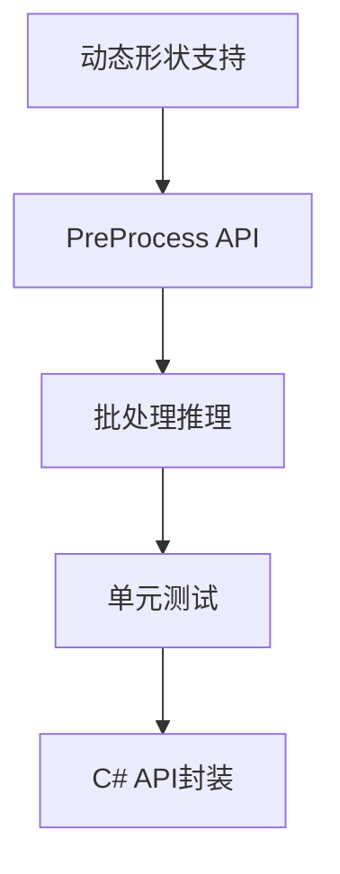

# OpenVINO 能力整理与集成计划

## 一、CudaRS项目中OpenVINO现有能力

### 1.1 已集成的核心功能

#### 模型加载与推理

- **文件**: [`cudars-ffi/src/openvino.rs`](cudars-ffi/src/openvino.rs)
- **能力**:
  - 支持ONNX格式模型加载 (`ov_core_read_model`)
  - 支持OpenVINO IR格式(.xml/.bin)
  - 模型编译与优化 (`ov_core_compile_model`)
  - 同步推理 (`cudars_ov_run`)
  - 异步推理 (`cudars_ov_run_async`)
  - 异步请求队列 (`cudars_ov_async_queue_submit/wait`)

#### 设备支持

```rust
pub enum CudaRsOvDevice {
    Cpu = 0,
    Gpu = 1,
    GpuIndex = 2, // GPU.0, GPU.1
    Npu = 3,
    Auto = 4,
}
```

- CPU设备推理
- GPU设备推理（单卡/多卡）
- NPU设备推理
- Auto自动设备选择

#### 性能配置

- **性能提示模式**: `PERFORMANCE_HINT` (latency/throughput)
- **流数控制**: `NUM_STREAMS` (并行流数量)
- **请求池**: `NUM_REQUESTS` / `NUM_INFER_REQUESTS`
- **模型缓存**: `CACHE_DIR` (编译模型缓存)
- **内存映射**: `ENABLE_MMAP`
- **性能分析**: `enable_profiling`

#### 高级特性

- **多请求异步推理池**:最多16个并发请求
- **属性自定义**: 支持JSON格式传递任意OpenVINO属性(最多16个)
- **设备名称覆盖**: 支持`DeviceName`指定复杂设备字符串(如`AUTO:GPU,CPU`)

### 1.2 应用层集成

#### YOLO模型推理

- **文件**: [`cudars-ffi/src/sdk/yolo_openvino_pipeline.rs`](cudars-ffi/src/sdk/yolo_openvino_pipeline.rs)
- 自动图像解码(JPEG/PNG)
- Letterbox预处理
- NCHW/NHWC布局自动推断
- CPU端图像处理

#### 通用张量推理

- **文件**: [`cudars-ffi/src/sdk/openvino_tensor_pipeline.rs`](cudars-ffi/src/sdk/openvino_tensor_pipeline.rs)
- 任意模型通用推理接口
- 多输出张量支持
- 异步队列模式

#### C# 高级API

- **文件**: [`dotnet/CudaRS/OpenVino/`](dotnet/CudaRS/OpenVino/)
- Fluent构建器模式 (`CudaRsFluent`)
- 原生模型API (`OpenVinoNativeModel`)
- 异步队列API (`OpenVinoAsyncQueue`)

---

## 二、OpenVINO 2025 原生能力分析

### 2.1 已支持的核心能力✅

| 能力分类 | 具体功能 | CudaRS集成状态 |

|---------|---------|---------------|

| **模型格式** | PyTorch, TensorFlow, ONNX, PaddlePaddle | ✅ ONNX, IR |

| **推理模式** | 同步/异步推理 | ✅ 完整 |

| **性能提示** | latency/throughput模式 | ✅ 完整 |

| **设备支持** | CPU, GPU, NPU, AUTO | ✅ 完整 |

| **数据类型** | FP32, FP16, BF16, INT8 | ✅ 模型级 |

| **异步API** | 多请求并发 | ✅ 请求池 |

| **模型缓存** | 编译缓存加速 | ✅ CACHE_DIR |

### 2.2 缺失的高级能力❌

#### 2.2.1 模型优化能力

- ❌ **动态形状(Dynamic Shapes)**: 运行时可变输入尺寸
- ❌ **输入预处理**: OpenVINO内置预处理API (resize, normalize, layout转换)
- ❌ **模型量化**: INT8量化推理(需NNCF工具链)
- ❌ **权重压缩**: FP16/INT8权重压缩
- ❌ **剪枝/稀疏化**: 模型稀疏化支持

#### 2.2.2 框架集成

- ❌ **PyTorch直接集成**: `torch.compile`支持
- ❌ **TensorFlow Lite**: TFLite模型直接加载
- ❌ **PaddlePaddle**: 直接加载PaddlePaddle模型(非ONNX转换)

#### 2.2.3 生成式AI能力

- ❌ **GenAI API**: 专门的LLM/生成模型推理API
- ❌ **MoE模型**: Mixture of Experts优化(2025.4新增)
- ❌ **KV缓存**: 生成式模型的KV缓存管理

#### 2.2.4 高级推理特性

- ❌ **批处理推理**: 显式batch推理API
- ❌ **多模型组合**: Pipeline多模型串联
- ❌ **远程推理**: OpenVINO Model Server集成
- ❌ **设备亲和性**: 精细的设备/NUMA控制
- ❌ **推理统计**: 详细性能指标(层级时间)

#### 2.2.5 硬件加速

- ❌ **iGPU支持**: 集成显卡推理(需GPU插件)
- ❌ **多GPU调度**: 多卡负载均衡
- ❌ **Intel DL Boost**: AVX512_VNNI等指令集优化(隐式支持)

#### 2.2.6 开发工具

- ❌ **性能分析器**: `ov::profiling` API详细分析
- ❌ **可视化工具**: 模型结构可视化
- ❌ **基准测试**: 内置benchmark工具集成

---

## 三、集成优先级建议

### 高优先级🔴 (核心功能增强)

#### 1. 动态形状支持

**价值**: YOLO等模型支持任意输入尺寸,无需固定640x640

```rust
// 新增API
fn ov_model_reshape(model: *mut c_void, 
                    new_shape: &[PartialShape]) -> c_int;
fn ov_compiled_model_create_infer_request_dynamic(...);
```

**影响文件**:

- `cudars-ffi/src/openvino.rs` - 添加reshape绑定
- `cudars-ffi/src/sdk/yolo_openvino_pipeline.rs` - 动态输入支持

#### 2. OpenVINO预处理API

**价值**: GPU上完成预处理,减少CPU-GPU数据传输

```rust
// PrePostProcessor API
fn ov_preprocess_prepostprocessor_create(...);
fn ov_preprocess_input_tensor_info_set_element_type(...);
fn ov_preprocess_input_model_info_set_layout(...);
```

**影响文件**:

- `cudars-ffi/src/openvino.rs` - 预处理API绑定
- `cudars-ffi/src/sdk/openvino_config_utils.rs` - 配置解析

#### 3. 批处理推理

**价值**: 吞吐量提升2-4倍

```rust
// 批量输入接口
pub fn run_batch(
    &mut self,
    inputs: &[*const f32],
    batch_size: usize,
    ...
) -> Result<Vec<Vec<OpenVinoOutput>>, SdkErr>
```

**影响文件**:

- `cudars-ffi/src/sdk/openvino_tensor_pipeline.rs`
- `dotnet/CudaRS/OpenVino/OpenVinoPipeline.cs`

### 中优先级🟡 (易用性提升)

#### 4. 模型信息查询

```rust
// 查询模型输入输出元信息
pub struct ModelMetadata {
    pub inputs: Vec<TensorInfo>,   // name, shape, dtype
    pub outputs: Vec<TensorInfo>,
}
fn cudars_ov_get_model_metadata(...) -> ModelMetadata;
```

#### 5. 性能分析器集成

```csharp
public class InferenceProfile {
    public TimeSpan PreprocessTime { get; set; }
    public TimeSpan InferenceTime { get; set; }
    public Dictionary<string, TimeSpan> LayerTimes { get; set; }
}
```

#### 6. INT8量化推理

- 集成NNCF量化模型加载
- 自动精度检测(FP32/FP16/INT8)

### 低优先级🟢 (高级场景)

#### 7. GenAI API集成

- LLM推理专用API
- 流式生成支持

#### 8. 多模型Pipeline

- 模型串联(Det + Rec)
- 自动数据流管理

#### 9. 远程推理

- OpenVINO Model Server客户端
- gRPC/REST API

---

## 四、实施路线图

### Phase 1: 核心功能增强(2-3周)



**交付物**:

- 动态YOLO推理
- GPU预处理
- 批量推理示例

### Phase 2: 工具与优化(1-2周)

- 模型元信息查询
- 性能分析器
- 自动精度选择

### Phase 3: 高级特性(按需)

- GenAI集成
- Model Server
- 多模型Pipeline

---

## 五、技术细节

### 5.1 动态形状实现示例

```rust
// cudars-ffi/src/openvino.rs
#[repr(C)]
pub struct CudaRsOvPartialShape {
    pub rank: i64,
    pub dims: *mut OvPartialDim,  // -1表示动态维度
}

#[repr(C)]
pub struct OvPartialDim {
    pub is_static: bool,
    pub value: i64,  // -1 for dynamic
}

#[no_mangle]
pub extern "C" fn cudars_ov_reshape_model(
    handle: CudaRsOvModel,
    input_shapes: *const CudaRsOvPartialShape,
    num_inputs: usize,
) -> CudaRsResult {
    // 调用 ov_model_reshape
    // 重新编译模型
}
```

### 5.2 预处理API集成

```cpp
// C API 示例(需绑定)
ov_preprocess_prepostprocessor_t* ppp;
ov_preprocess_prepostprocessor_create(model, &ppp);

ov_preprocess_input_info_t* input_info;
ov_preprocess_input_info_get_tensor_info(ppp, &input_info);

// 设置输入为 U8 [H,W,C]
ov_preprocess_input_tensor_info_set_element_type(input_info, U8);
ov_preprocess_input_tensor_info_set_layout(input_info, "NHWC");

// 设置模型期望 FP32 [1,C,H,W]
ov_preprocess_input_model_info_set_layout(input_info, "NCHW");

// 添加预处理步骤
ov_preprocess_preprocess_steps_t* steps;
ov_preprocess_input_info_get_preprocess_steps(input_info, &steps);
ov_preprocess_preprocess_steps_resize(steps, RESIZE_LINEAR);
ov_preprocess_preprocess_steps_convert_element_type(steps, FP32);

// 构建新模型
ov_model_t* new_model;
ov_preprocess_prepostprocessor_build(ppp, &new_model);
```

### 5.3 批处理推理

```rust
// yolo_openvino_pipeline.rs
pub fn run_batch_images(
    &mut self,
    images: &[&[u8]],  // 多张图片字节数组
) -> Result<Vec<Vec<OpenVinoOutput>>, SdkErr> {
    let batch_size = images.len();
    
    // 1. 批量解码和预处理
    let preprocessed = images.par_iter()
        .map(|img| decode_and_preprocess(img))
        .collect::<Vec<_>>();
    
    // 2. 拼接为单个batch tensor
    let batch_tensor = stack_tensors(&preprocessed);
    
    // 3. 推理
    let shape = vec![batch_size as i64, 3, H, W];
    self.run_tensor(batch_tensor.as_ptr(), ...)?;
    
    // 4. 分离输出
    Ok(split_batch_outputs(&self.outputs, batch_size))
}
```

---

## 六、风险与挑战

### 技术风险

1. **动态形状性能**: 每次reshape需重新编译,首次推理慢

   - **缓解**: 提供常用尺寸预编译

2. **C API覆盖度**: OpenVINO某些高级功能仅C++ API

   - **缓解**: 必要时使用C++包装层

3. **多线程安全**: OpenVINO Core对象需线程安全管理

   - **缓解**: 使用`Mutex`保护或每线程单独Core

### 兼容性风险

1. **OpenVINO版本**: 2024.x vs 2025.x API差异

   - **缓解**: 条件编译 + 版本检测

2. **驱动依赖**: GPU插件需对应驱动版本

   - **缓解**: 详细错误提示 + 文档

---

## 七、资源需求

### 开发时间估算

- Phase 1 (核心功能): 120-150小时
- Phase 2 (工具优化): 60-80小时  
- Phase 3 (高级特性): 100-150小时

### 测试资源

- 多种输入尺寸模型
- INT8量化模型
- 多GPU环境
- 性能基准数据集

### 文档更新

- API参考文档
- 集成指南
- 性能调优手册
- 故障排查FAQ

---

## 八、总结

**当前状态**: CudaRS已集成OpenVINO的基础推理能力(60%覆盖率),支持同步/异步推理、多设备、性能调优。

**关键缺失**: 动态形状、内置预处理、批处理、量化支持等高级功能。

**建议行动**: 优先实施Phase 1(动态形状+预处理+批处理),可在1个月内显著提升灵活性和性能。